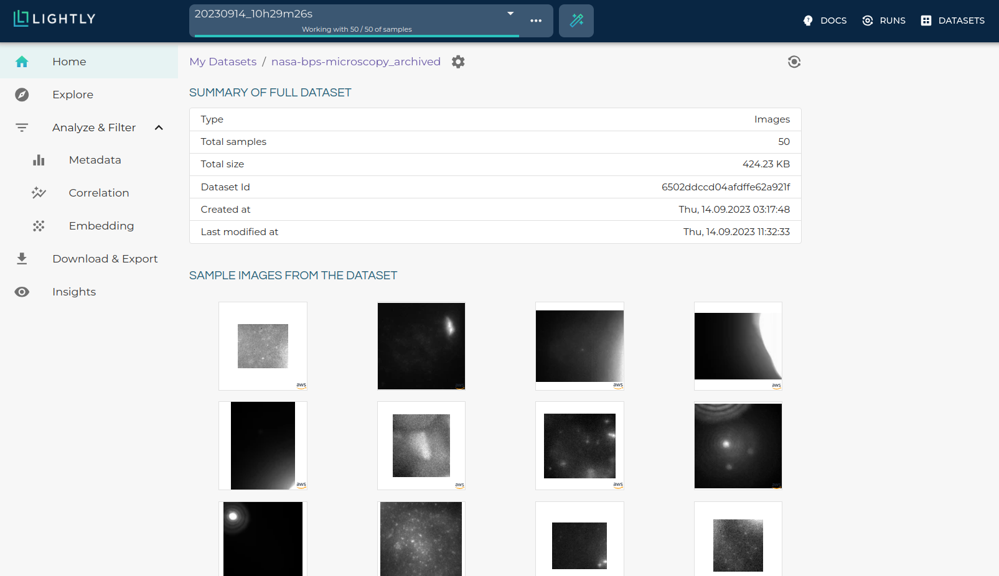
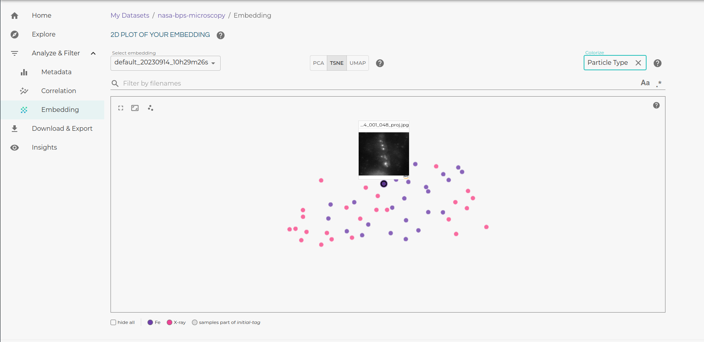
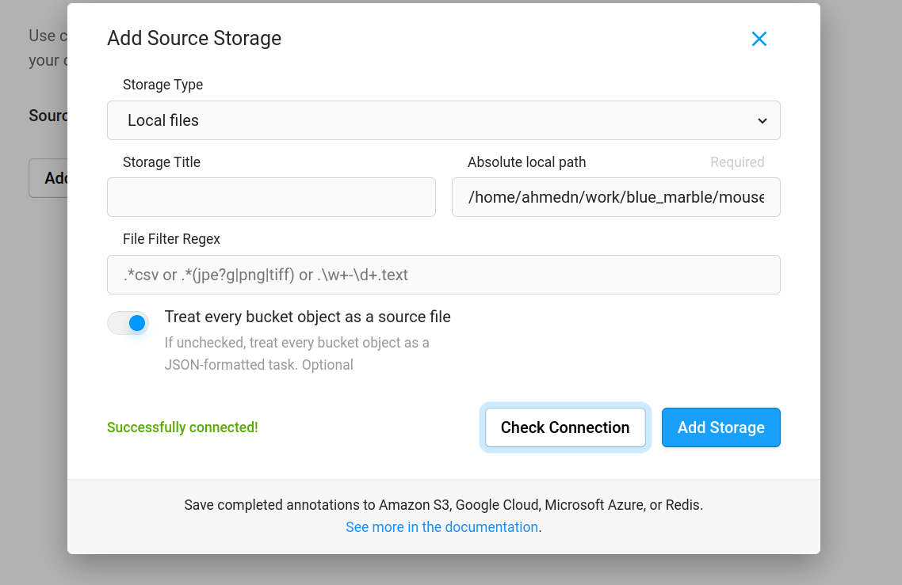
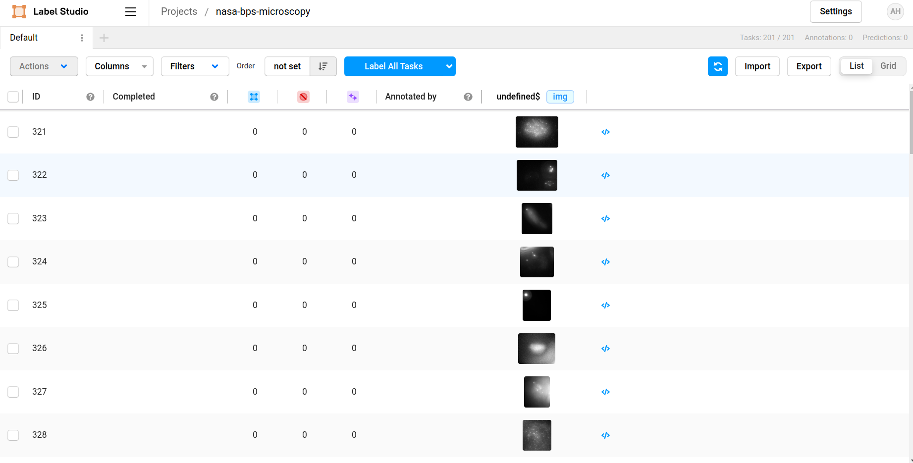
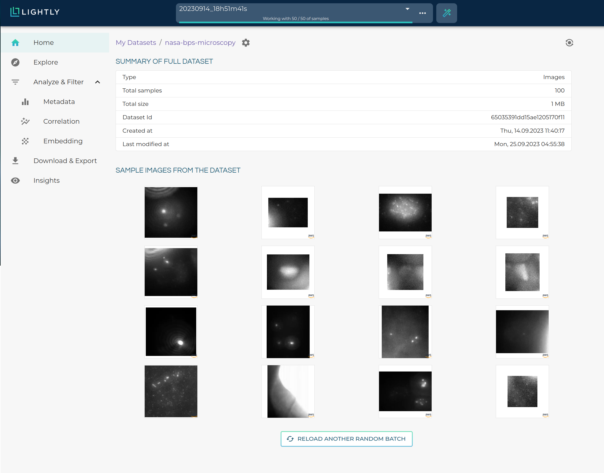
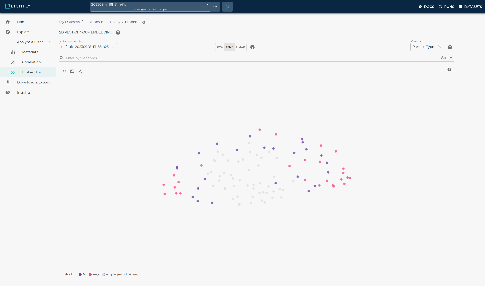
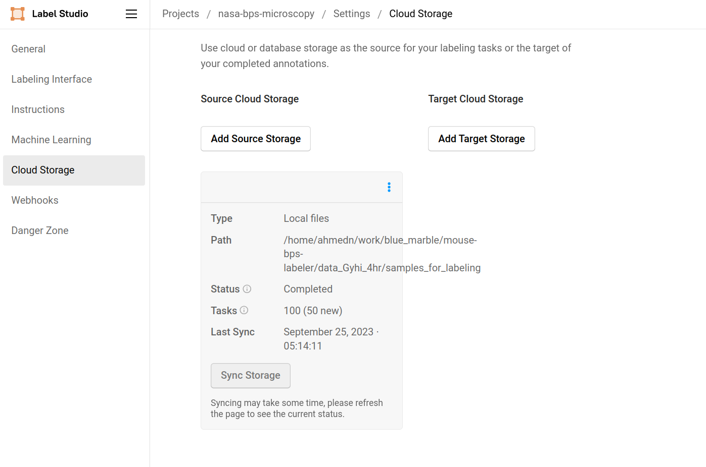

# BPS Mouse Microscopy Active Learning Labeler
- Author: @nadia-eecs
- Acknowledgements & Appreciation To: @igorsusmelj


This repository demonstrates a complete workflow of training a machine learning model with the aid of Active Learning using [Lightly](https://www.lightly.ai) and [Label Studio](https://labelstud.io) and has been adapted heavily (esp. this README.md) from [Lightly_LabelStudio_AL](https://github.com/lightly-ai/Lightly_LabelStudio_AL/tree/main).

## Built With
[](https://lightly.ai/)
[](https://www.labelstudio.ai/)
[](https://wandb.ai/home)
[](https://github.com/PyTorchLightning/pytorch-lightning)


[](https://github.com/ellerbrock/open-source-badges/)
[](https://github.com/Naereen/StrapDown.js/blob/master/LICENSE)
[](https://github.com/nadia-eecs)

## Why is Active Learning?
Labeling data is expensive! We can make the task easier by utilizing Active Learning to select a subset of unlabeled data to be labeled and then used to train a model. By selecting well, the model can have similar or better performance than if trained on the entire dataset. [lightly.ai blog post](https://www.lightly.ai/post/active-learning-method-overview)

Assume we have a new unlabelled dataset and want to train a new model. We do not want to label all samples because not all of them are valuable. Lightly can help select a good subset of samples to kick off labeling and model training. The loop is as follows:

1. Lightly chooses a subset of the unlabelled samples.
2. This subset is labeled using Label Studio.
3. A machine learning model is trained on the labeled data and generates predictions for the entire dataset.
4. Lightly consumes predictions and performs Active Learning to choose the next batch of samples to be labeled.
5. This new batch of samples is labeled in Label Studio.
6. The machine learning model is re-trained on the enriched labeled dataset and to achieve better performance.


Let's get started!

## 0. Installation and Requirements
Make sure you have an account for the [Lightly Web App](https://app.lightly.ai). 
You also need to know your API token which is shown under your `USERNAME` -> `Preferences`.

Clone this repo and install all Python package requirements in the `requirements.txt` file, e.g. with pip.
```bash
git clone https://github.com/blue-marble-space-institute-of-science/mouse-bps-labeler.git
cd mouse-bps-labeler
pip install -r requirements.txt
```
### Providing Data To Lightly Via Cloud Storage
#### Creating a Lightly Dataset
Datasources enable Lightly to access data in the cloud. They need to be configured with credentials. To create a datasource you must specify a dataset, the credentials, and a `resource_path` which must point to a directory within the storage bucket.

A Lightly Dataset can support the following image file types:

- `png`
- `jpeg`
- `bmp`
- `gif`
- `tiff`
#### Input Datasource
The input datasource is the raw input that Lightly reads. Lightly requires *list* and *read* access.

##### Configuring a Remote Datasource AWS S3 Edition
Lighly needs to have `read`, `list`, `write`, and `delete` permissions:
- `s3:GetObject` (if read only)
- `s3:ListBucket` (if read only)
- `s3:PutObject`
- `s3:DeleteObject`

For detailed documentation see [AWS S3 Lightly Documentation](https://docs.lightly.ai/docs/aws-s3)
##### Delegated Access:
Identify Lightly as a user with a role int he AWS account. Use this if internal or external policies require it and if security and compliance are important.

- 1. Log into AWS IAM Console
- 2. Create Role
- 3. Select AWS Account and configure ID and Access Policy for Lightly.

## 1. Prepare data
We want to train a classifier to predict whether the microscopy image contains a linear arrangement of 53BP1 accumulation on chromatin surrounding DNA damage,
or irradiation induced foci. We use this dataset: [Biological and Physical Sciences (BPS) Microscopy Benchmark Training Dataset](https://aws.amazon.com/marketplace/pp/prodview-6eq625wnwk4b6#overview).

### 1.1 `00_download_Gyhi_4hr_from_s3_source.sh` To Download High Radiation Dosage and 4 Hour Post Exposure Conditions of the BPS Data
Run `00_download_Gyhi_4hr_from_s3_source.sh` to download a subset of the publicly available BPS Mouse Microscopy data locally. In this example, we will be using the portion of the dataset for high radiation (Gy) exposure levels and 4 hours post-radiation and will store the information in directory called `data_Gyhi_4hr`

```sh
chmod +x bps_labeler/scripts/a_data_setup/00_download_Gyhi_4hr_from_s3_source.sh
./bps_labeler/scripts/a_data_setup/00_download_Gyhi_4hr_from_s3_source.sh
```

After downloading the data, you will see the data directory as follows:

```
data_Gyhi_4hr/
├── meta.csv
├── filtered_files.txt
├── filtered_meta.csv
├── P242_73665006707-A6_003_013_proj.tif
├── P242_73665006707-A6_008_034_proj.tif
├── P242_73665006707-A6_009_007_proj.tif
...
```
Since metadata is available in `filtered_meta.csv` we would like to separate out the metadata for use with Lightly which requires a specific format. [Lightly metadata format](https://docs.lightly.ai/docs/work-with-metadata). In other words, all rows in the csv file must be written as a json with the same file stem as the `.tif` images.

### 1.2 `01_local_data_setup_lightly.py`

```sh
python bps_labeler/scripts/a_data_setup/00_generate_json_from_meta_csv.py
```

`01_local_data_setup_lightly.py` does the following tasks to ensure local setup of data suitable for AWS S3 datasource configuration with the Lightly platform. It performs the following tasks:
- Converts the 16bit uint TIFF files into JPG for easy rendering with Lightly and Labeler UI
- Extracts metadata from `metadata.csv` to create individual JSON files for each TIF
- Splits the dataset into training and validation sets with their respective data and metadata
- Generates the Lightly metadata `schema.json` for processing the JSON individual file metadata
  
#### 16 Bit to JPG Image Conversion
The BPS Mouse data is currently available in 16 uint TIFF format. In order for images to render both in the Lightly Platform and Label Studio, the images must be reduced to JPG format. In this implementation, to optimize space we replace the files with the JPG format.
#### Extract Metadata from CSV to JSON
We extract metadata from CSV to JSON to generate individual json files with the same filestem as the images containing information with respect to the filename, the radiation exposure, the particle, and the post exposure time period. These files will also save to `data_Gyhi_4hr` and you will be able to see the data directory as follows while the script runs:

```
data_Gyhi_4hr/
├── meta.csv
├── filtered_files.txt
├── filtered_meta.csv
├── P242_73665006707-A6_003_013_proj.jpg
├── P242_73665006707-A6_003_013_proj.json
├── P242_73665006707-A6_003_013_proj.tif
├── P242_73665006707-A6_008_034_proj.jpg
├── P242_73665006707-A6_008_034_proj.json
├── P242_73665006707-A6_008_034_proj.tif
├── P242_73665006707-A6_009_007_proj.jpg
├── P242_73665006707-A6_009_007_proj.json
├── P242_73665006707-A6_009_007_proj.tif
...
```
#### Training and Validation Split
Running `01_local_data_setup_lightly.py` additionally splits the files into the directories `train_set` and `val_set` and migrates the files and their corresponding metadata to subdirectories `data` and `metadata`. 

The parent directory will remain `data_Gyhi_4hr` and you will be able to see the data directory as follows:
  
```
data_Gyhi_4hr/
├── train_set/
│   ├── data/
│   │   ├── P242_73665006707-A6_003_013_proj.jpg
│   │   ├── P242_73665006707-A6_008_034_proj.jpg
│   │   ├── P242_73665006707-A6_009_007_proj.jpg
│   │   ...
│   └── meta/
│       ├── P242_73665006707-A6_003_013_proj.json
│       ├── P242_73665006707-A6_008_034_proj.json
│       ├── P242_73665006707-A6_009_007_proj.json
│       ...
├── val_set/
│   ├── data/
│   │   ├── P242_73665006707-G3_005_027_proj.jpg
│   │   ...
│   └── meta/
│       ├── P242_73665006707-G3_005_027_proj.json
│       ...
├── filtered_files.txt
├── filtered_meta.csv
├── full_train.json
├── meta.csv
└── val.json
...
```

After this, note the following files and directories in the current directory:
* `train_set`: Directory that contains all samples to be used for training the model and the associated metadata for each .jpg image
* `val_set`: Directory that contains all samples to be used for model validation. It may be helpful to label them to check performance though for our purposes it is not.
* `full_train.json`: JSON file that records paths to all files in `train_set`.
* `val.json`: JSON file that records paths of all files in `val_set`.

#### Schema for Metadata for Lightly Platform
In order for the Lightly platform to read the associated metadata for each individual .tif file, a [`schema.json`](https://docs.lightly.ai/docs/work-with-metadata) file must contain a list of configuration entries. There is one generated based on the metadata for the BPS Mouse Microscopy dataset.
### 1.2 `02_upload_training_set_Gyhi_4hr_to_s3_dest.sh` Upload Training Samples to Cloud Storage
In this tutorial, samples are stored in the cloud, and Lightly Worker will read the samples from the cloud data source. For details, please refer to [Set Up Your First Dataset](https://docs.lightly.ai/docs/set-up-your-first-dataset). Here we use Amazon S3 as an example.

Under your S3 bucket, create two directories: `data` and `lightly`. We will upload all training samples to `data`. For example, run the [AWS CLI tool](https://aws.amazon.com/cli/):

```sh
chmod +x bps_labeler/scripts/a_data_setup/02_upload_training_set_Gyhi_4hr_to_s3_dest.sh
./bps_labeler/scripts/a_data_setup/02_upload_training_set_Gyhi_4hr_to_s3_dest.sh
```

After uploading the samples, your S3 bucket should look like
```
s3://bucket/
├── lightly/
│   └── .lightly/
│       └── metadata/
│           ├── schema.json
│           ├── P242_73665006707-A6_003_013_proj.json
│           ├── P242_73665006707-A6_008_034_proj.json
│           ├── P242_73665006707-A6_009_007_proj.json
│           ...
└── data/
    ├── P242_73665006707-A6_003_013_proj.jpg
    ├── P242_73665006707-A6_008_034_proj.jpg
    ├── P242_73665006707-A6_009_007_proj.jpg
    ├── ...
```
## 2. Select the first batch of samples for labeling

### 2.1 Start the Lightly Worker in Docker
To setup the Lightly Worker on your machine run the following script:
```sh 
./bps_labeler/scripts/b_label_first_selection/03_start_lightly_worker.sh
```


Now, with all unlabelled data samples in your training dataset, we want to select a good subset, label them, and train our classification model with them. Lightly can do this selection for you in a simple way. The script [03_run_first_selection.py](./bps_labeler/label_first_batch/03_run_first_selection.py) does the job for you. You need to first set up Lightly Worker on your machine and put the correct configuration values in the script. Please refer to [Install Lightly](https://docs.lightly.ai/docs/install-lightly) and [Set Up Your First Dataset](https://docs.lightly.ai/docs/set-up-your-first-dataset) for more details.

Run the script after your worker is ready:

```sh
python bps_labeler/scripts/b_label_first_selection/03_run_first_selection.py
```

In this script, Lightly Worker first creates a dataset named `nasa-bps-microscopy` within the Lightly Platform, selects 50 samples based on embeddings of the training samples and particle type metadata and records them in this dataset. It does this to ensure diverse sampling and balance respectively. These 50 samples are the ones that we are going to label in the first round. You can see the selected samples in the [Web App](https://app.lightly.ai/).



## 3. Label the selected samples to train a classifier

We do this using the open source labeling tool **Label Studio**, which is a browser-based tool hosted on your machine.
You have already installed it and can run it from the command line. It will need access to your local files. We will first download the selected samples, import them in Label Studio, label them, and export the annotations.

_Curious to get started with Label Studio? Check out [this tutorial](https://labelstud.io/blog/zero-to-one-getting-started-with-label-studio/) for help getting started!_

#### 3.1 Download the selected samples

We can download the selected samples from the Lightly Platform. The [04_download_samples.py](./bps_labeler/label_first_batch/04_download_samples.py) script will do everything for you and download the samples to a local directory called `data_Gyhi_4hr/samples_for_labeling`.

```sh
python bps_labeler/scripts/b_label_first_selection/04_download_samples.py
```

Lightly Worker created a tag for the selected samples. This script pulls information about samples in this tag and downloads the samples.

#### 3.2 Run LabelStudio

Now we can launch LabelStudio.

```sh
export LABEL_STUDIO_LOCAL_FILES_SERVING_ENABLED=true && label-studio start
```

You should see it in your browser. Create an account and log in.

#### 3.3 Configure Storage

Create a new project called "nasa-bps-microscopy".
Then, head to `Settings` -> `Cloud Storage` -> `Add Source Storage` -> `Storage Type`: `Local files`.
Set the `Absolute local path` to the absolute path of directory `samples_for_labeling`.
Enable the option `Treat every bucket object as a source file`.
Then click `Add Storage`. It will show you that you have added a storage.
Now click on `Sync Storage` to finally load the 50 images.



##### 3.4 Instructions and Configuring the Labeling Interface
In `Settings` -> `Instructions` you may insert `Labeling Instructions`
```
Please review the following NASA BPS Fluorescence microscopy images of individual nuclei from mouse fibroblast cells. Cells that have been irradiated high energy radiation, may incur double stranded DNA damage.  Identifying tracks or linear arrangements of bright visible and circular fluorescent foci indicate 53BP1 repair mechanisms. In the images featured please do your best to classify the images as having a:

- track
- no track 

Thank you for your contributions!
```

In the `Settings` -> `Labeling Interface` in the `Code` insert
```xml
<View>
    <Image name="image" value="$image"/>
        <Choices name="choice" toName="image">
        <Choice value="track"/>
        <Choice value="no track"/>
    </Choices>
</View>
```


It tells Label Studio that there is an image classification task with 2 distinct choices.

#### 3.5 Labelling

Now if you click on your project again, you see 50 tasks and the corresponding images.
Click on `Label All Tasks` and get those 50 images labeled.



**Pro Tip!** Use the keys `1`, `2`, on your keyboard as hotkeys to be faster!

#### 3.6 Export labels

Export the labels via `Export` in the format `JSON-MIN`.
Rename the file to `annotation-0.json` and place that in a directory called  `data_Gyhi_4hr/ls_annotations/` in the data directory of this repository.

## 4. Finetune a model and prepare for active learning

We can train a classification model with the 50 labeled samples. The [train_model_1.py](./bps_labeler/train_model/train_model_01.py) script loads samples from `annotation-0.json` and performs this task.

```sh
python bps_labeler/scripts/c_train_model/train_model_01_resnet.py
```

The following steps are performed in this script:
* Load the annotations and the labeled images.
* Load the validation set (optional as this depends on having a small set of ground truth labels which we do not have)
* Fine tune a simple model as in [resnet50.py](./bps_labeler/model/resnet50.py).
* Use model trained on a sampling of the data to compute label predictions for all samples for training, including unlabeled samples. These will be used for balancing your next dataset split.
* Dump the predictions in [Lightly Prediction format](https://docs.lightly.ai/docs/prediction-format#prediction-format) into directory `lightly_predictions` in your AWS datasource.

It is okay for now. We will improve this. Predictions will be used for active learning.

### 4.1 Upload predictions to data source

Lightly Worker also does active learning for you based on predictions. It consumes predictions stored in the data source. We need to place the predictions we just acquired in the data source. For detailed information, please refer to [Predictions Folder Structure](https://docs.lightly.ai/docs/prediction-format#predictions-folder-structure). Here we still use the AWS S3 bucket as an example.

In the `lightly` directory you created earlier in your S3 bucket, you will create a subdirectory `.lightly/predictions` where predictions are kept. You need the following additional files. You can create these files directly by copying the code blocks below.

##### tasks.json
```json
["bps-classification"]
```

We only have one task here, and let's name it as `bps-classification`.

##### schema.json
```json
{
    "task_type": "classification",
    "categories": [
        {
            "id": 0,
            "name": "track"
        },
        {
            "id": 1,
            "name": "no track"
        }
    ]
}
```

Place these files in the `lightly` directory in your bucket along with predictions from your local directory `lightly_prediction` by running:

```
./bps_labeler/scripts/c_train_model/06_upload_predictions_s3.sh 
```
After uploading these files, your S3 bucket should look like
```
s3://bucket/
├── lightly/
│   └── .lightly/
│       ├── metadata/
│       │   └── ...
│       └── predictions/
│           ├── tasks.json
│           └── bps-classification/
│               ├── schema.json
│               ├── P242_73665006707-A6_003_013_proj.json
│               ├── P242_73665006707-A6_008_034_proj.json
│               ├── P242_73665006707-A6_009_007_proj.json
│               ├── ...
└── data/
    ├── P242_73665006707-A6_003_013_proj.jpg
    ├── P242_73665006707-A6_008_034_proj.jpg
    ├── P242_73665006707-A6_009_007_proj.jpg
    ├── ...
```

where files uploaded are local prediction files in `lightly_prediction` to the s3 bucket in `lightly/.lightly/predictions/bps-classification`.

## 5. Select and label new samples

With the predictions, Lightly Worker can perform active learning and select new samples for us. The [06_run_second_selection.py](bps_labeler/scripts/d_label_second_selection/06_run_second_selection.py) script does the job.

```sh
python bps_labeler/scripts/d_label_second_selection/07_run_second_selection.py
```
Note: if your Lightly Worker is not started you may need to rerun:
```
./bps_labeler/scripts/b_label_first_selection/03_start_lightly_worker.sh
```
This time, Lightly Worker goes through all training samples again and selects another 50 samples based on active learning scores computed from the predictions we uploaded in the previous step. For more details, please refer to [Selection Scores](https://docs.lightly.ai/docs/selection#scores) and [Active Learning Scorer](https://docs.lightly.ai/docs/active-learning-scorers).

You can see the results in the Web App.





#### Label new samples

You can repeat step 3 to download and label new samples. 
```
python bps_labeler/scripts/b_label_first_selection/04_download_samples.py
```

To import new samples, go to `Settings` -> `Cloud Storage` and then click `Sync Storage` on the Source Cloud Storage you created earlier. A message `Synced 50 task(s)` should show up.



Then, you can go back to the project page and label the new samples. After finishing annotating the samples, export the annotations again. Rename the file to `annotation-2.json` and place that in the root directory of this repository.

## 6. Train a new model with the new samples
Very similar to the script in step 4, script [08_train_model_02_resnet.py](bps_labeler/scripts/e_train_model/08_train_model_02_resnet.py) loads samples from `annotation-2.json` and trains the classification model again with all 60 labeled samples now.

```sh
python bps_labeler/e_train_model/08_train_model_02_resnet.py
```
## Celebrate! You've improved your model with the help of Label Studio and Lightly! 
